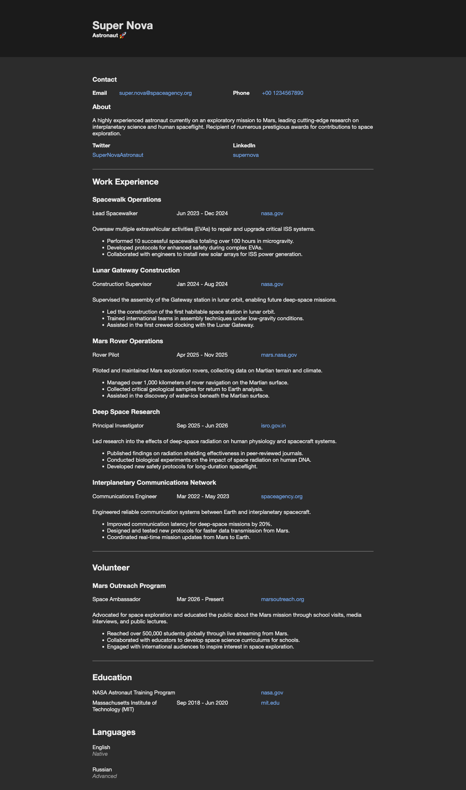
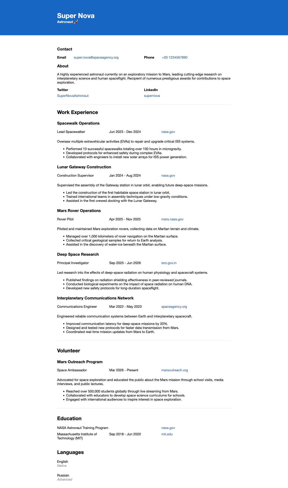

# (S)Tone theme for JSON Resume

[](https://github.com/hgosansn/jsonresume-theme-tone/actions/workflows/github_pages_hosting.yml)

A self-contained theme for [JSON Resume](http://jsonresume.org/). 
Designed to work offline and hosted on github pages.

## Usage

```sh
# List existing automation scripts
jq .scripts ./package.json
```

## Features

### JSON Resume 1.0.0

This supports the JSON Resume 1.0.0 spec, and is backward compatible with earlier versions.

### Application Tracking System (ATS) Friendly

Many companies and recruiters use [ATS](https://en.wikipedia.org/wiki/Applicant_tracking_system) systems that [parse CV's](https://en.wikipedia.org/wiki/R%C3%A9sum%C3%A9_parsing) and extract the information into a standard format. Part of maintaining this theme includes reviewing this and adhering to standard practices when building the résumé.

### Markdown

You can use inline Markdown on properties to make text bold, italic, or link them to external pages. This namely applies to the `summary` and `highlights` properties in the JSON Resume schema.

### Open Graph Protocol

Populates the `head` of the HTML document with [Open Graph](https://ogp.me/) tags. This allows social media platforms and instant messengers to create embeds when your résumé is shared.

### Dark Mode

Includes a dark mode, and uses the [`prefers-color-scheme`](https://developer.mozilla.org/en-US/docs/Web/CSS/@media/prefers-color-scheme) CSS property to provide a positive user-experience.

### Optimized

This theme makes no external connections, doesn't embed scripts, and is lightweight by design. Both HTML and PDF exports will be minimal.

### Automated preview with puppeteer

This theme includes a script to generate a preview of the resume in both light and dark mode. This is useful for testing and debugging the theme.

> `npm run test`

### Uploaded to GitHub Pages on push

This theme is hosted on GitHub Pages, and is automatically updated when a `release-*` tag is pushed to the repository.
Check the `release.sh` script for more information.
For future forks, It requires to set the repository `/settings/pages -> source` to GitHub Actions.
Disable `/settings/environments/` protection rules to allow the GitHub Actions to release from main branch.

## Preview

<div style="display: flex; justify-content: space-between; gap: 20px;">
    
    
</div>

### Notes

* It's recommended to declare the `meta.language` property in your JSON Resume for accessibility. This is the [BCP47 tag](https://developer.mozilla.org/docs/Web/HTML/Global_attributes/lang#language_tag_syntax) for the language your your résumé is written in. For example, `en` for English.
